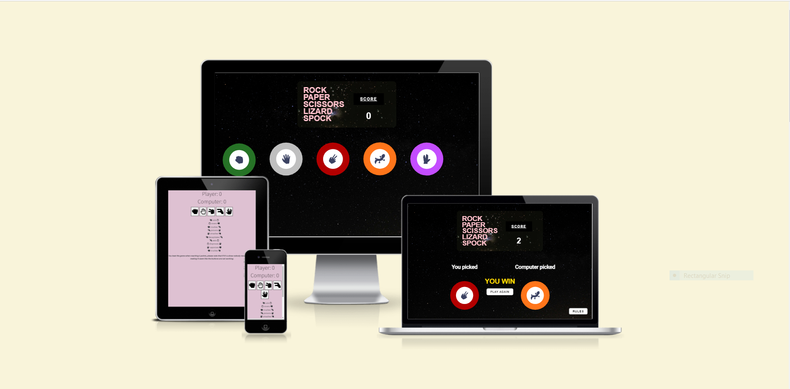

# Rock-Paper-Scissors-Lizard-Spock

RPSLS is a modified version of the traditional Rock Paper Scissors game, which was introduced by Sam Kass and Karen Bryla. It gained popularity after being featured on the television series The Big Bang Theory. This website offers an entertaining way to play RPSLS against the computer. The game relies completely on luck, and the website is user-friendly, with clear sections for the game rules.

There are two different versions available for playing RPSLS, one designed for mobile and another for desktop. Each version is tailored to its respective device, providing an optimal user experience. Whether playing on a mobile phone or a computer, users can enjoy the game of RPSLS with ease.

Visit the deployed website [here](https://gabriel5638.github.io/Rock-Paper-Scissors-Spock-Game/)

## Table of Contents

1. [User Experience (UX)](#user-experience-UX)
    1. [Project Goals](#project-goals)
    2. [User Stories](#user-stories)
    3. [Images](#images)
    4. [Typography](#fonts)
2. [Features](#features)
    1. [General](#general)
    2. [Home Section](#home-section)
    3. [Instructions Section](#instructions-section)
    4. [Game section](#game-section)
    5. [Result Section](#result-section)
3. [Technologies Used](#technologies-used)
    1. [Languages Used](#languages-used)
    2. [Frameworks, Libraries and Programs Used](#frameworks-libraries-and-programs-used)
4. [Testing](#testing)
    1. [Testing User Stories](#testing-user-stories)
    2. [Code Validation](#code-validation)
    3. [Accessibility](#accessibility)
    4. [Tools Testing](#tools-testing)
    5. [Manual Testing](#manual-testing)
5. [Finished Product](#finished-product)
6. [Deployment](#deployment)
    1. [GitHub Pages](#github-pages)
7. [Credits](#credits)
    1. [Content](#content)
    2. [Media](#media)
    3. [Code](#code)
8. [Acknowledgements](#acknowledgements)

***

### Project Goals

* Develop a website with a user-friendly structure and intuitive navigation for playing the Rock Paper Scissors Lizard Spock game.
* Utilize engaging colors and interactive elements to enhance the user's gaming experience.
* Ensure that the website's design is responsive, allowing the game to be played on various devices with ease.
* Provide easy access to the game rules and controls to enhance the user's understanding of the game.
* Enable the game to be played on different devices, making it accessible to a wider range of users.

### User Stories

* As a player, I want the game's website to be easy to navigate.

* As a player, I would like the website to be aesthetically pleasing and engaging, making it enjoyable to play the game.

* As a player, I want to have easy access to the game rules.

* As a player, I want the game controls to be easy to access during the game.

* As a player, I want to be able to play the game on various devices.

### Images

* The website's visuals were carefully curated to align with the game's overarching theme of space and neon, inspired by the iconic Star Trek character, Spock. The selection of images sourced from the Pexels website showcases this theme and contributes to an immersive gaming experience that transports users into the game's world. Through the incorporation of these images, the website successfully captures the essence of the game's space-themed elements, offering users a visually engaging and memorable experience.

