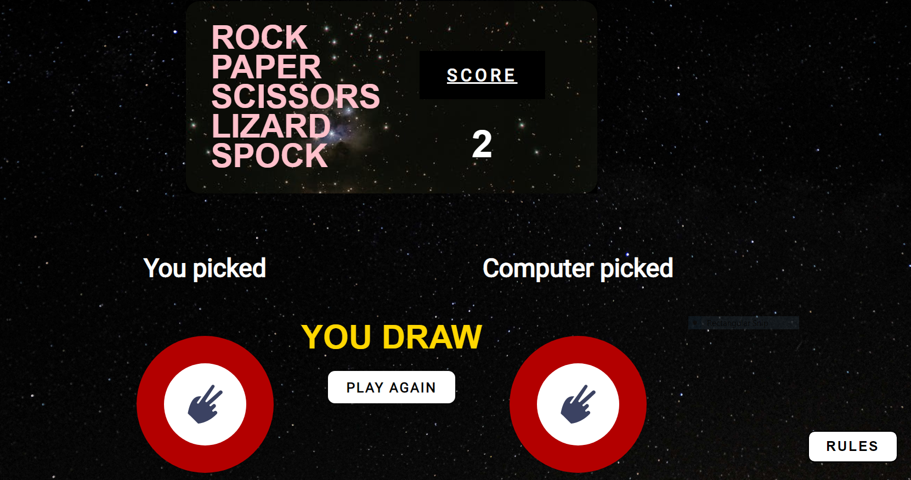

# Rock-Paper-Scissors-Lizard-Spock

RPSLS is a modified version of the traditional Rock Paper Scissors game, which was introduced by Sam Kass and Karen Bryla. It gained popularity after being featured on the television series The Big Bang Theory. This website offers an entertaining way to play RPSLS against the computer. The game relies completely on luck, and the website is user-friendly, with clear sections for the game rules.

There are two different versions available for playing RPSLS, one designed for mobile and another for desktop. Each version is tailored to its respective device, providing an optimal user experience. Whether playing on a mobile phone or a computer, users can enjoy the game of RPSLS with ease.

Visit the deployed website [here](https://gabriel5638.github.io/Rock-Paper-Scissors-Spock-Game/)

## Table of Contents

1. [User Experience (UX)](#user-experience-UX)
    1. [Project Goals](#project-goals)
    2. [User Stories](#user-stories)
    3. [Images](#images)
    4. [Typography](#fonts)
    5. [Wireframes](#wireframes)
2. [Features](#features)
    1. [Play Button](#play-button)
    2. [Score](#score)
    3. [Rules](#rules)
    4. [Choice](#choice)
    5. [Buttons](#buttons)
    6. [GIFs](#gifs)
    7. [Mobile Version](#mobile-version)
3. [Technologies Used](#technologies-used)
    1. [Languages Used](#languages-used)
    2. [Frameworks, Libraries and Programs Used](#frameworks-libraries-and-programs-used)
4. [Testing](#testing)
    1. [Testing User Stories](#testing-user-stories)
    2. [Code Validation](#code-validation)
    3. [Accessibility](#accessibility)
    4. [Tools Testing](#tools-testing)
    5. [Manual Testing](#manual-testing)
5. [Finished Product](#finished-product)
6. [Deployment](#deployment)
    1. [GitHub Pages](#github-pages)
7. [Credits](#credits)
    1. [Content](#content)
    2. [Media](#media)
    3. [Code](#code)
8. [Acknowledgements](#acknowledgements)

***

### Project Goals

* Develop a website with a user-friendly structure and intuitive navigation for playing the Rock Paper Scissors Lizard Spock game.
* Utilize engaging colors and interactive elements to enhance the user's gaming experience.
* Ensure that the website's design is responsive, allowing the game to be played on various devices with ease.
* Provide easy access to the game rules and controls to enhance the user's understanding of the game.
* Enable the game to be played on different devices, making it accessible to a wider range of users.

### User Stories

* As a player, I want the game's website to be easy to navigate.

* As a player, I would like the website to be aesthetically pleasing and engaging, making it enjoyable to play the game.

* As a player, I want to have easy access to the game rules.

* As a player, I want the game controls to be easy to access during the game.

* As a player, I want to be able to play the game on various devices.

### Images

* The website's visuals were carefully curated to align with the game's overarching theme of space and neon, inspired by the iconic Star Trek character, Spock. The selection of images sourced from the Pexels website showcases this theme and contributes to an immersive gaming experience that transports users into the game's world. Through the incorporation of these images, the website successfully captures the essence of the game's space-themed elements, offering users a visually engaging and memorable experience.

* The selection of button colors, which comprise green, red, orange, purple, and grey, was carefully curated to ensure they would stand out amidst the dark background. These colors were intentionally chosen to complement the overall aesthetic of the game and create a visually engaging user experience that captures the essence of the game's theme.

### Typography

Roboto and Josefin Sans were the fonts chosen, and by using them, the letters were blockier, simpler to see, and more reminiscent of video games, particularly the Roboto font, which has a more cartoonish appearance.

### Wireframes

[Balsamiq](https://balsamiq.com/) has been used to design the main game screen. 

### Features

* The website boasts two distinct versions, each outstanding in their own right and made to deliver a seamless user experience on both desktop and mobile platforms.

## Play Button

 
- The homepage features a thoughtfully designed neon-pink button, styled with precision using CSS, that illuminates upon hovering. The button offers a link to an engaging HTML-embedded game of RPSLS, inviting users to click and enjoy a captivating gaming experience.

## Score

- The score area was designed to be easy to look at and intresting at the same time, it has the rock paper scissors spock logo and the holds the point count.

## Rules

- The modal's grey background and black text ensure excellent visibility, while its clear and concise rules make them easy to understand.
- The modal also features an exit button, providing a convenient and intuitive way for users to close the modal when they are finished reviewing its content. This addition further enhances the user experience, making the modal both practical and user-friendly.

## Choice

- The choice area displays the results of what the user and computer chose, determines whether it is a win, loss, or draw, and also shows the scoreboard with the number of points the player received.

## Buttons

- The buttons are clickable and provide the user with a unique sound for each selection: rock, paper, scissors, lizard, or Spock. After the user clicks the "play again" button, the buttons will bounce to signify the beginning of a new round.

## Gifs

 - GIFs were used for both the desktop and mobile versions. The GIFs are displayed when a player reaches 6 points on the desktop version, congratulating the winner and showing a funny GIF of the actors from Star Trek, including Spock himself. The GIFs appear at random, users gets a different one each time they win. This adds replayability to the game, so players can discover new GIFs with each playthrough.

## Mobile Version

- The button notifies the user that there is a different version available for mobile, while the dark background blocks the desktop version.

 
- The menu is smaller to make it easier to play on the phone, and the buttons are tailored for small screens as well.

## Technologies Used

### Languages Used
* [HTML5](https://en.wikipedia.org/wiki/HTML5)
* [CSS3](https://en.wikipedia.org/wiki/CSS)
* [Javascript](https://en.wikipedia.org/wiki/JavaScript)

### Frameworks, Libraries and Programs Used

* [Google Fonts](https://fonts.google.com/)
    - Google Fonts was used to import the fonts Nunito and Odibee Sans into the style.css file. These fonts were used throughout the site.

* [Font Awesome](https://fontawesome.com/)
     - Font Awesome was used in the mobile version for making the buttons.

* [GitPod](https://gitpod.io/)
     - GitPod was used for writing code, committing, and then pushing to GitHub.

* [GitHub](https://github.com/)
     - GitHub was used to store the project after pushing.

* [Balsamiq](https://balsamiq.com/)
     - Balsamiq was used to create the wireframes during the design phase of the project.

* [Am I Responsive?](http://ami.responsivedesign.is/#)
    - Am I Responsive was used in order to see responsive design throughout the process and to generate mockup imagery to be used.

* [Responsive Design Checker](https://www.responsivedesignchecker.com/)
    - Responsive Design Checker was used in the testing process to check responsiveness on various devices.

* [Chrome DevTools](https://developer.chrome.com/docs/devtools/)
    - Chrome DevTools was used during development process for code review and to test responsiveness.

* [W3C Markup Validator](https://validator.w3.org/)
    - W3C Markup Validator was used to validate the HTML code.

* [W3C CSS Validator](https://jigsaw.w3.org/css-validator/)
    - W3C CSS Validator was used to validate the CSS code.

* [JSHint](https://jshint.com/) 
    - The JSHints JavaScript Code Quality Tool was used to validate the site's JavaScript code.

* [Google Fonts](https://fonts.google.com/)
    - Google Fonts was used to import the fonts Nunito and Odibee Sans into the style.css file. These fonts were used throughout the site.

* [Sweet Alert](https://sweetalert2.github.io/)
     - Sweet Alert was used to show the Gif notification area.

